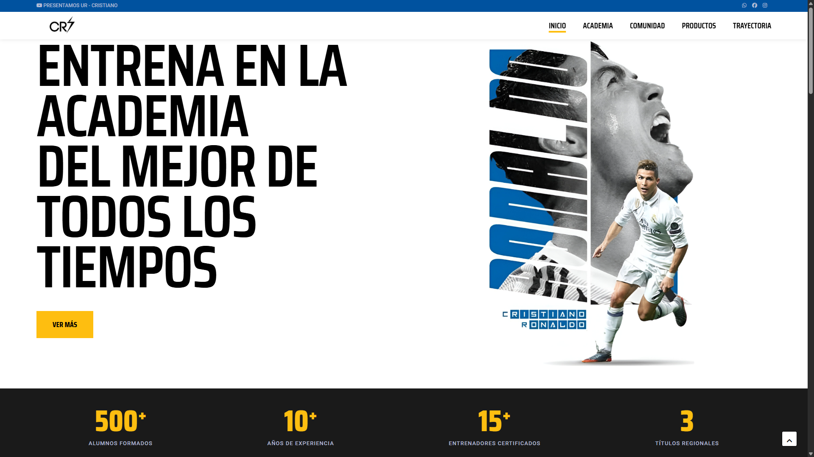
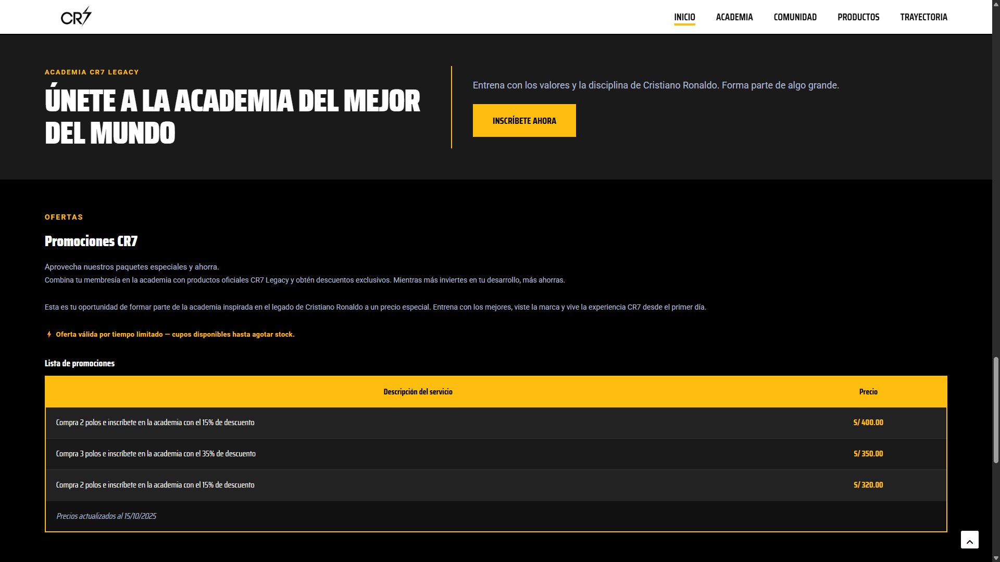
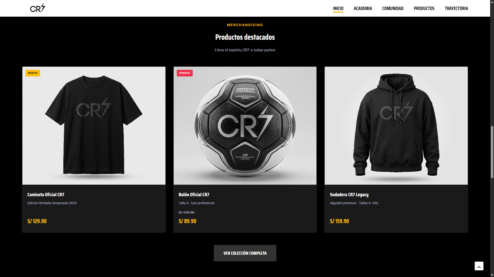

# ⚽ CR7 Legacy | Plataforma Deportiva


<p align="center">
  
</p>

Plataforma deportiva con academia de fútbol, tienda de merchandising y comunidad de fans, inspirada en el legado de Cristiano Ronaldo. Desarrollada como proyecto académico en la **UTP Lima** con diseño dark & gold de alto impacto visual.

---

## 🖼️ Vista previa

### 🏠 Hero — Landing Page


### 🎓 Academia CR7 Legacy


### 🛍️ Merchandising


---

## ✨ Secciones implementadas

| Sección | Descripción | Estado |
|---|---|---|
| 🏠 Inicio | Hero, estadísticas, programas y productos destacados | ✅ Completado |
| 🎓 Academia | Categorías Infantil, Juvenil y Élite con planes e inscripción | ✅ Completado |
| 🛍️ Productos | Tienda de merchandising oficial con precios y ofertas | ✅ Completado |
| 👥 Comunidad | Foro de fans y comunidad CR7 | 🔄 En desarrollo |
| 📅 Trayectoria | Línea de tiempo de la carrera deportiva | 🔄 En desarrollo |

---

## 🛠️ Stack tecnológico

| Tecnología | Uso |
|---|---|
| HTML5 | Estructura semántica del contenido |
| CSS3 | Paleta dark & gold, Flexbox/Grid, diseño responsive |
| JavaScript | Interactividad y manejo de eventos |

---

## 📁 Estructura del proyecto

```
cr7legacy/
│
├── index.html               # Landing Page principal
├── README.md
├── screenshots/             # Capturas para documentación
│   ├── hero.png
│   ├── academia.png
│   └── productos.png
│
└── assets/
    ├── css/                 # Hojas de estilo
    ├── img/                 # Imágenes y logos
    └── pages/               # Páginas secundarias
                             # (academia.html, comunidad.html,
                             #  productos.html, trayectoria.html)
```

---

## 🚀 ¿Cómo ejecutar?

1. Clona el repositorio:
```bash
git clone https://github.com/Diegols420/cr7legacy.git
```
2. Abre el archivo `index.html` en tu navegador

> No requiere instalación de dependencias — es 100% Vanilla.

---

## 👨‍💻 Autor

**Diego Lamas Solórzano** — Estudiante de Ing. de Sistemas, UTP Lima

[](https://www.linkedin.com/in/diego-lamas-solorzano-9209b5236/)
[](https://github.com/Diegols420)

---

## 📄 Licencia

Este proyecto es de uso académico y está disponible bajo la licencia [MIT](LICENSE).
